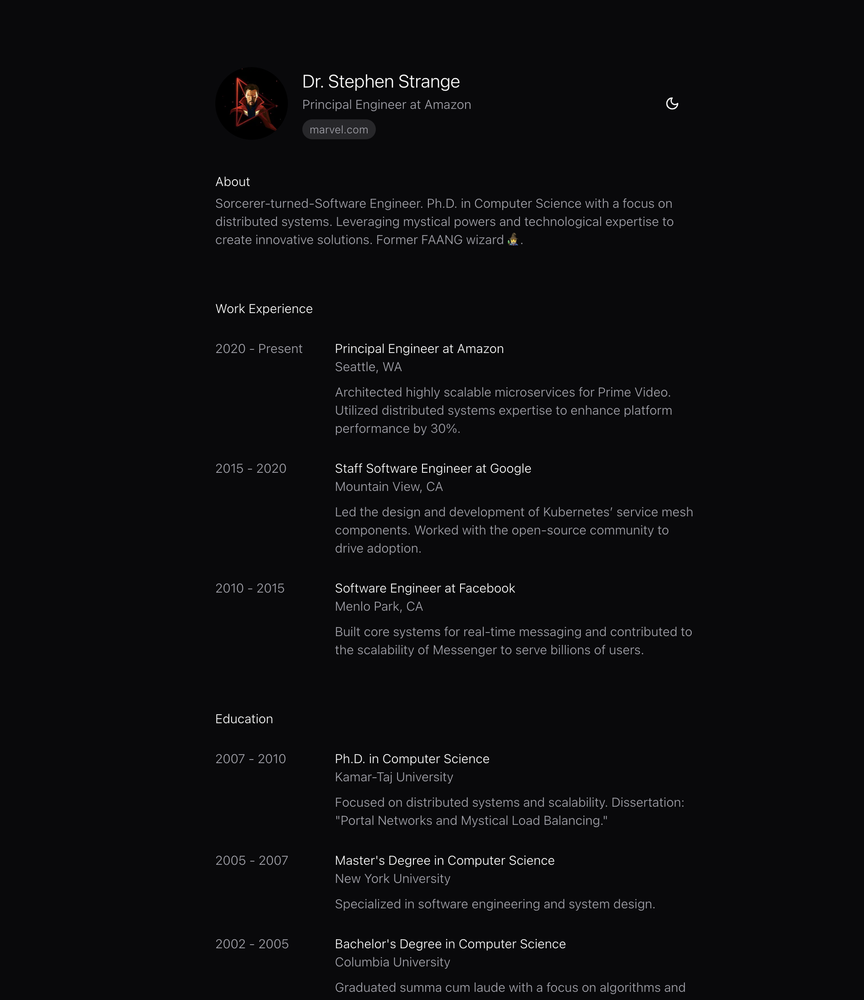

# next-cv




A personal CV website loosely based off of [react-cv](https://github.com/sbayd/react-cv) built with Next.js, TypeScript, Tailwind CSS, and Framer Motion.

## Getting Started

This is a [Next.js](https://nextjs.org/) project bootstrapped with [`create-next-app`](https://github.com/vercel/next.js/tree/canary/packages/create-next-app).

First, run the development server:

```bash
npm run dev
# or
yarn dev
# or
pnpm dev
# or
bun dev
```

Open [http://localhost:3000](http://localhost:3000) with your browser to see the result.

You can start editing the page by modifying `app/page.tsx`. The page auto-updates as you edit the file.

This project uses [`next/font`](https://nextjs.org/docs/app/building-your-application/optimizing/fonts) to automatically optimize and load [Geist](https://vercel.com/font), a new font family for Vercel.

## Configure CV

This project allows you to configure a CV using two primary files: `bio.ts` and `profile.ts`, located in the `data` directory. These files control the bio and profile information displayed in the CV. Below is a guide to configuring these files.

### `bio.ts`

The `bio.ts` file defines the key details about the individual. It includes the following fields:

- **`name`**: Your full name.
  Example: `"Dr. Stephen Strange"`

- **`avatar`**: A URL or file path to your avatar image.
  Example: `"/stephen-strange.jpg"`

- **`jobTitle`**: Your current job title. This can dynamically reference the most recent job from `profile.ts`.
  Example: `"Principal Engineer at Amazon"`

- **`website`**: Your personal or professional website.
  Example: `"https://marvel.com"`

- **`about`**: A short bio about yourself, highlighting key achievements or background.
  Example:
  ```plaintext
  "Sorcerer-turned-Software Engineer. Ph.D. in Computer Science with a focus on distributed systems. Leveraging mystical powers and technological expertise to create innovative solutions. Former FAANG wizard 🧙‍♂️."
  ```

- **`contacts`**: An array of objects containing your contact information:
	- **`label`**: The type of contact (e.g., Email, Github, LinkedIn).
	- **`value`**: The displayed value of the contact.
	- **`href`**: The URL or action triggered when the contact is clicked.

  Example:
  ```javascript
  [
    {
      label: 'Email',
      value: 'stephen.strange@amazon.com',
      href: '#',
    },
    {
      label: 'Github',
      value: 'doctorstrange',
      href: '#',
    },
    {
      label: 'LinkedIn',
      value: 'doctorstrange',
      href: '#',
    },
  ]
  ```

### `profile.ts`

The `profile.ts` file organizes your professional experience and education into a structured format. It uses the following fields:

#### Top-Level Structure

- **`title`**: The category of information (e.g., "Work Experience," "Education").
- **`items`**: An array of objects detailing specific entries for the category.

#### Fields in `items`

Each object in `items` includes the following:

- **`title`**: The title of the position or degree.
  Example: `"Principal Engineer at Amazon"`

- **`subTitle`**: Additional details, such as location or institution.
  Example: `"Seattle, WA"`

- **`link`** (optional): A URL related to the item, such as a company or institution's website.
  Example: `"https://amazon.com"`

- **`date`**: The date or duration of the position or education.
  Example: `"2020 - Present"`

- **`description`**: A detailed description of your role, responsibilities, or achievements.
  Example:
  ```plaintext
  "Architected highly scalable microservices for Prime Video. Utilized distributed systems expertise to enhance platform performance by 30%."
  ```

#### Example Structure

##### Work Experience

```javascript
{
  title: 'Work Experience',
  items: [
    {
      title: 'Principal Engineer at Amazon',
      subTitle: 'Seattle, WA',
      date: '2020 - Present',
      description:
        'Architected highly scalable microservices for Prime Video. Utilized distributed systems expertise to enhance platform performance by 30%.',
    },
    {
      title: 'Staff Software Engineer at Google',
      subTitle: 'Mountain View, CA',
      date: '2015 - 2020',
      description:
        'Led the design and development of Kubernetes’ service mesh components. Worked with the open-source community to drive adoption.',
    },
  ],
}
```

##### Education

```javascript
{
  title: 'Education',
  items: [
    {
      title: "Ph.D. in Computer Science",
      subTitle: 'Kamar-Taj University',
      date: '2007 - 2010',
      description:
        'Focused on distributed systems and scalability. Dissertation: "Portal Networks and Mystical Load Balancing."',
    },
    {
      title: "Master's Degree in Computer Science",
      subTitle: 'New York University',
      date: '2005 - 2007',
      description: 'Specialized in software engineering and system design.',
    },
  ],
}
```

## Using the Configuration

1. Open the `bio.ts` file to update personal details like your name, avatar, job title, and contact information.
2. Edit the `profile.ts` file to add or update your work experience and education. Use the structured format to ensure consistency.
3. Save the changes, and your CV will automatically reflect the updated details.

This structure ensures a clear and customizable way to showcase your CV effectively!

## Learn More

To learn more about Next.js, take a look at the following resources:

- [Next.js Documentation](https://nextjs.org/docs) - learn about Next.js features and API.
- [Learn Next.js](https://nextjs.org/learn) - an interactive Next.js tutorial.

You can check out [the Next.js GitHub repository](https://github.com/vercel/next.js/) - your feedback and contributions are welcome!

## Deploy on Vercel

The easiest way to deploy your Next.js app is to use the [Vercel Platform](https://vercel.com/new?utm_medium=default-template&filter=next.js&utm_source=create-next-app&utm_campaign=create-next-app-readme) from the creators of Next.js.

Check out our [Next.js deployment documentation](https://nextjs.org/docs/deployment) for more details.
